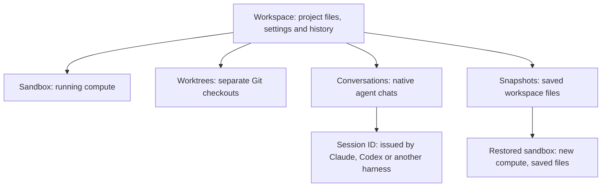

# Workspaces and conversations

Use `cws-agent resume` to choose a conversation across your running and saved
workspaces. It reconnects to live compute or restores the latest saved workspace
before continuing the conversation with its original agent.

## Understand the objects



A **workspace** is the project and saved state you return to. Its optional name
appears beside the agent in the picker. A **sandbox** is one running compute
instance. Restoring creates a new sandbox ID.

A **conversation** is a chat owned
by an agent harness. Its **session ID** comes from that harness, not cws-agent.
A **snapshot** saves workspace files, including available conversation history.
It doesn't save running processes. A **worktree** is a separate Git checkout
inside a workspace.

The existing `session start`, `session ls`, `session attach`, and `session restart`
commands manage worktree agents. `session history` and `session resume` refer to
the agent's own conversations. These command names remain supported.

## Resume work

Choose from the picker, or scope your selection to a workspace or conversation:

```bash
cws-agent resume
cws-agent resume project1
cws-agent resume SESSION_ID
cws-agent resume --sandbox SANDBOX_ID --session SESSION_ID
cws-agent claude project1 --resume SESSION_ID
```

Use **↑** or **↓** to move, **Enter** to choose, and **Esc** to cancel. Type to filter.
The picker shows the workspace, agent, conversation preview, activity, and state.
Selecting a workspace with several saved conversations opens the same picker
scoped to that workspace.

The positional argument accepts a workspace name, sandbox ID, or the agent's own session
ID. UUID-shaped IDs are checked in both namespaces. Ambiguous matches require a
choice. `--sandbox`, `--session`, and `--agent` provide explicit scope.

`--agent` selects the original harness. It doesn't convert conversations between
agents. Claude, Codex, and OpenCode use the saved project directory.
`--cwd /remote/path` overrides it. Devin and Cursor require a named workspace
and use their own history interface.

All resume spellings share the same compute lifecycle. Add `--running-only` to
prevent allocation, or `--no-attach` to prepare a workspace without opening a
terminal. A running workspace takes precedence over its saved snapshots.

`connect NAME` opens a fresh agent terminal in running compute. `restore NAME`
remains available for advanced snapshot recovery without choosing a conversation.

### Saved state and another computer

A stopped workspace can resume when it has a `READY` snapshot. Recovery restores
the whole workspace to that snapshot, then verifies the requested conversation.
Changes after the snapshot are unavailable. Exiting an agent doesn't create a
new snapshot or stop compute. Use `cws-agent stop NAME` to save and stop.

Names and agent types for saved work are discovered from cws-agent snapshot
metadata. Unrelated snapshots are excluded. Conversation previews and creation
configuration are also cached privately on the computer that ran cws-agent.
On another computer, choose the workspace first. Its conversations become
available after restoring its files. If the agent's session ID isn't indexed,
that ID alone can't identify a stopped workspace.

If the original configuration is unavailable, the CLI shows proposed defaults
and offers **Restore**, **Change**, or **Cancel** before allocating compute.
Changing configuration means rerunning with options such as `--image`, `--cpu`,
`--memory`, `--disk`, or `--lifetime`. Credentials aren't stored in the catalog.
Required environment values must be available again. If secret or volume references are unavailable,
use [explicit shell recovery options](shell.md#save-work-and-stop-compute).

### Understand picker metadata

Discovery reads the agent's own history on demand, without listeners or background
agents. Claude and Codex previews use bounded transcript excerpts, skipping
recognized injected and metadata records. OpenCode supplies its own title and
update metadata.

File modification times are approximate and appear with `~`.
Unknown times appear as `—`. Snapshot time is separate from conversation activity.
Large histories may show IDs and approximate times when the preview budget is
exhausted.

A failed history lookup doesn't discard other workspaces. Partial discovery
requires an explicit selection rather than automatically resuming its only match.
Cloud runner workspaces appear as unavailable rows: their provider-managed
conversations can't be resumed through the CLI history interface. Focus the row
to see the reason and its documentation link.

### Cloud code runners

The picker includes workspaces that run provider-managed agents, but marks their
conversations unavailable. Their chat history belongs to the provider and isn't
stored as a resumable CLI conversation. Use that provider's conversation interface
or the runner's documented lifecycle commands. `restore` can recover the saved
workspace files; it doesn't resume a provider-managed chat.

### Compatibility

`resume` previously aliased `restore`. It selects and continues conversations,
including those in live workspaces. Scripts needing the old behavior should use
`restore`. Workspace bookkeeping is updated automatically. No manual metadata
migration is required.

`stop NAME` saves a snapshot and stops compute. `down` remains a compatibility
alias with the same flags and behavior. `stop --no-snapshot` skips saving.

## Several agents in one sandbox

Start an agent for each task in its own Git worktree and branch:

```bash
cws-agent launch work --local-dir . --detach
cws-agent login work
# Sign in, then exit the agent.
cws-agent session start work fix-auth --prompt "Fix the login bug"
cws-agent session start work add-tests --prompt "Add parser tests"
cws-agent session ls work
cws-agent session attach work fix-auth
cws-agent session diff work fix-auth
```

Detach with **Ctrl-b, d**. The agent keeps working. Worktrees live under
`/workspace/sessions/NAME` on `agent/NAME` branches, sharing the repository's Git
objects. Agents share the sandbox and credentials. Worktrees separate files,
not access permissions.

New worktrees start from the project `HEAD`. To include local changes, commit them
before uploading. Override with `--base` or `--branch`.

Agents default
to [YOLO](permissions.md). `session start` requires a new name. `attach` only
joins an existing session. Install and authenticate another CLI before selecting
it with `--agent`.

```bash
cws-agent session stop work add-tests
```

Stop removes the worktree and keeps its branch. It fails if the worktree has uncommitted changes.
`--force` discards them. `--delete-branch` also deletes the retained branch.

## Resume an agent session or restart a worktree agent

In the following commands, `work` is a sandbox, `fix-auth` is a worktree session, and
`SESSION_ID` identifies an agent's saved chat.

```bash
cws-agent session history work
cws-agent session resume work SESSION_ID
cws-agent session restart work fix-auth --attach
```

`resume` continues a saved agent session. `restart` uses an existing worktree's
files and branch, continuing its latest agent session where supported. Use
`--session-id ID` to choose one. Stop the original agent session before resuming
it elsewhere.

`restore` recreates the sandbox from a snapshot. It restores files and branches,
not running processes. Use `session restart` afterward.

History supports [Claude](https://code.claude.com/docs/en/sessions),
[Codex](https://developers.openai.com/codex/cli/reference/#codex-resume), and
OpenCode workspace projects. For another OpenCode directory, add
`--agent opencode --cwd /remote/path`. Cursor uses its own picker:

```bash
cws-agent session history cursor1 --agent cursor
cws-agent session resume cursor1 CHAT_ID --agent cursor
cws-agent session resume open1 ses_SESSION_ID --agent opencode
cws-agent session resume devin1 brisk-otter --agent devin
```

For [Devin history](https://docs.devin.ai/cli/essential-commands#session-history),
connect to its CLI and run `/ls --all`. Devin and Cursor `session resume` require
`--agent`. Cursor defaults to `/workspace/project` unless you supply `--cwd`.
History commands for the agent's own conversations can't enumerate provider-managed cloud conversations. The global resume picker shows their workspaces as unavailable.

## Move CLI session history between machines

Stop source and destination agents first. For Claude and Codex:

```bash
cws-agent sync work ./my-repo
cws-agent session transfer work --upload LOCAL_SESSION_ID
cws-agent session resume work LOCAL_SESSION_ID
# Later, from your local project directory:
cws-agent session transfer work --download REMOTE_SESSION_ID
```

Transfer copies history, including supported inline images and Claude subagent
assets. Sync project files separately. Credentials, tool configuration, project
memory, and external attachments aren't copied. Wait for the printed resume
instructions before continuing.

Use `--agent claude` or `--agent codex` to disambiguate an ID. `--cwd` selects an
absolute destination project path. Defaults are `/workspace/project` for uploads
and your current directory for downloads. Existing history requires `--replace`,
which saves backups beside replaced files.

Transfers support recognized JSONL histories in the agent's own format, up to 32 MiB and 256 files.
Use compatible agent versions. Desktop-only or cloud-only histories and Codex sidecar histories
are unsupported. Old paths in message text and file-rewind data may still refer
to the source machine. History can contain sensitive prompts, tool output, and
images.

[OpenCode](opencode.md#continue-a-conversation-elsewhere) has its own export and import
with different limits. Cursor transfer is unsupported. Devin offers
[ATIF export](https://docs.devin.ai/cli/reference/commands), but no supported import
through its own CLI. Its history and [Outpost sessions](https://docs.devin.ai/cloud/outposts/overview)
can't be transferred here.
